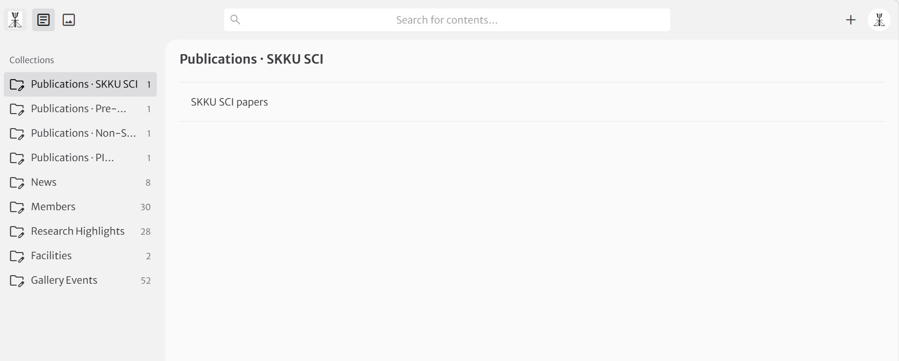

# SKKU-STEM Lab Website — PRD

> **작성일:** 2026-05-09
> **상태:** v1 (라이브 배포 완료, CMS 도입 보류)
> **저장소:** https://github.com/SKKU-STEM/skku-stem-website
> **라이브:** https://skkustem.org
>
> 본 문서는 2026-05-09에 구축한 SKKU-STEM Lab 홈페이지의 사양·의사결정·운영 환경을 정리한 PRD이자, 향후 유사한 학술 연구실 홈페이지 제작 시 재사용 가능한 실행 프롬프트 템플릿(부록 A)을 포함한다.

---

## 1. 프로젝트 개요

| 항목 | 내용 |
|---|---|
| **목표** | 기존 Google Sites(`https://sites.google.com/site/skkustem`) 기반 연구실 홈페이지를 모던 정적 사이트로 이전. 콘텐츠 풍부도 + 디자인 일관성 + 유지보수성 동시 확보 |
| **타겟 사용자** | (1) 협력 연구자/외부 방문자: 연구 주제·논문·시설 빠른 파악, (2) 입학 지원자: 멤버·연구분야·연락처 확인, (3) PI·랩 멤버: 콘텐츠 갱신 |
| **PI** | 김영민 교수 (Young-Min Kim) — 성균관대학교 에너지과학과 |
| **연구 주제** | Aberration-corrected STEM + 전자분광(EELS/EDX) + 4D-STEM + electron tomography + ML/DL 융합으로 에너지 소재의 원자 단위 구조·화학 분석 |
| **개발 기간** | 1일 (2026-05-09, 김영민 교수의 첫 홈페이지 제작) |
| **결과물** | 라이브 사이트 + GitHub 저장소 + Cloudflare Pages 자동 배포 + GSC 등록 |

---

## 2. 기술 스택

| 영역 | 선택 | 선택 이유 |
|---|---|---|
| 프레임워크 | **Astro 5.18** + TypeScript strict | 정적 생성에 최적화, 컴포넌트 단위 부분 hydration, 학술 사이트는 거의 정적이므로 SSG가 가장 빠름 |
| 스타일 | **Tailwind CSS 4** (via `@tailwindcss/vite`) | CSS-first `@theme` 토큰, JIT, 클래스 기반 디자인 일관성. v3의 `@astrojs/tailwind`가 아닌 v4용 vite 플러그인 사용 |
| 폰트 | **`@fontsource-variable/*`** (self-hosted) | Newsreader (serif/display) + Inter (sans) + JetBrains Mono. 외부 CDN 의존성 제거, GDPR/속도 유리 |
| 검색 | **Pagefind 1.2** | 정적 사이트용 클라이언트 사이드 검색, 빌드 시 `dist/pagefind` 인덱스 생성. (현재 미통합 상태로 dependency만 포함) |
| 이미지 | Astro Image (sharp 서비스) | 자동 리사이즈/포맷 변환. 일부는 `public/` 직접 경로 사용 (PortraitBox `srcPath` prop) |
| 화학식 렌더링 | 자체 유틸 (`src/utils/chemistry.ts`) | `V_O` → `V<sub>O</sub>` 변환. 논문 제목·연구 highlight에 `set:html`로 적용 |
| 호스팅 | **Cloudflare Pages** | 무료, 무제한 대역폭, 자동 SSL, GitHub 연동 자동 배포, 글로벌 CDN |
| 도메인 | **skkustem.org** (Cloudflare DNS + CNAME flattening) | apex 도메인 직접 사용, www 서브도메인 없음 |
| 분석 | **Cloudflare Web Analytics** | 쿠키리스, 무료, GDPR 친화. `PUBLIC_CF_ANALYTICS_TOKEN` 환경변수로 옵트인 |
| SEO | `@astrojs/sitemap` + 자체 `robots.txt` + Google Search Console | Domain property로 등록, sitemap-index.xml 제출 완료 |

---

## 3. 디자인 시스템

### 3.1 색상 팔레트

| 토큰 | 값 | 용도 |
|---|---|---|
| `--color-cream` | `#FAF9F5` | 배경 (warm off-white) |
| `--color-ink` | `#141413` | 본문 텍스트, 다크 푸터 배경 |
| `--color-coral` | `#CC785C` | 강조색 (CTA, 링크 hover, 아이콘) |
| 파생 cream-50~400 | `#FDFCF9 → #C9C5B4` | placeholder, subtle bg |
| 파생 ink-300~900 | `#8E8C86 → #141413` | 보조 텍스트 단계 |
| 파생 coral-400~700 | `#D8957D → #8C4D3A` | hover/disabled 상태 |

### 3.2 타이포그래피

- **Display/H1~H6**: Newsreader Variable (serif, italic 강조어용)
- **본문**: Inter Variable (sans, ss01 / cv11 OpenType features)
- **Mono**: JetBrains Mono Variable (코드, 작은 카테고리 라벨)
- 한글: 시스템 sans 폴백 (별도 한글 웹폰트 없이 Pretendard/Noto Sans KR 시스템 폰트 채택)
- 사용 패턴: 헤드라인 italic + 코랄 강조 (`<em class="italic text-coral">atom by atom</em>`)

### 3.3 레이아웃 토큰

| 토큰 | 값 | 용도 |
|---|---|---|
| `--container-page` | `70rem` (1120px) | 페이지 최대폭 |
| `--container-prose` | `45rem` (720px) | 본문 가독폭 |
| `--space-section` / `-md` | `3.5rem` / `6rem` | 섹션 수직 간격 |
| `--header-height` | `4rem` (64px) | sticky 헤더 높이 |
| `scroll-padding-top` | `5rem` | 앵커 점프 시 헤더 가림 방지 |

### 3.4 모션

- `--animate-breathe`: CTA 버튼용 2.6s scale + 코랄 후광 펄스. `Recent highlights` Read 링크와 메인 Contact 버튼에 적용

### 3.5 디자인 원칙 (시행착오로 확립)

- **opacity tier**: border는 `/15`, 텍스트 보조는 `/60` 기준. `/10`은 너무 옅고 `/25`는 너무 진해 사용 자제
- **dashed placeholder**: `border border-dashed border-ink/15` — 멤버 사진 미등록 시 사용
- **hover**: 링크는 `text-coral`, 카드는 `-translate-y-0.5 + shadow-soft`
- **emoji 금지**: 필요 시에만 (사용자 미요청)

---

## 4. 정보 구조 (Information Architecture)

```
/                         Home (split hero + recent highlights + recruiting CTA)
├── /research             year-grouped highlight timeline (28 entries)
├── /people
│   ├── /people           Postdocs / Ph.D. Candidates / Undergrads / Alumni
│   └── /people/pi        Full CV (bio, education, appointments, honors, selected pubs)
├── /publications
│   ├── /publications              SKKU SCI papers (179)
│   ├── /publications/before-skku  Before SKKU SCI (52)
│   └── /publications/non-sci-patents  Non-SCI + Patents (29)
├── /news                 categorized bulletin (시상/발표/이벤트)
├── /gallery              photo mosaic with native <dialog> lightbox
└── /facilities           instruments (JEM-ARM300F, ARM200F)
```

네비게이션 우선순위 (Header 좌→우): Home / Research / People / Publications / News / Gallery / Facilities. `Join`, `Contact` 별도 페이지는 두지 않고 Home의 recruiting 섹션 + footer 이메일 링크로 통합.

### 4.1 콘텐츠 마이그레이션 매핑

`memory/reference_old_site.md` 참조 — Google Sites 슬러그 ↔ 새 Astro 경로 1:1 매핑. 주요 변경:
- `/our-company` → `/people` + `/people/pi` 분리
- `/contact-us` → 통합 (PI 페이지 하단으로)
- `/publications` 단일 → 3개 하위 페이지 분리

---

## 5. 페이지별 사양

### 5.1 Home (`/`)
- **Hero**: 좌(텍스트) + 우(그룹사진 `2026group-spring.jpg`) 분할. 타이틀 `Decoding matter, atom by atom` (italic + coral 강조)
- **Recent highlights**: `publications-skku.ts`에서 `lead === true` 필터 후 상위 3건 자동 표시. 데이터 추가만 하면 자동 갱신
- **Recruiting CTA**: SVG 배경(원자 격자 + CV 검출 링 + 스캔 라인) + radial mask로 페이드아웃 + Contact 메일 버튼

### 5.2 Research (`/research`)
- 연도별 세로 타임라인. 각 연도는 `position: sticky`로 좌측 고정 (그리드 wrapper로 overlap 방지)
- 28건의 highlight, `formatChemistry` 유틸로 화학식 렌더

### 5.3 People (`/people`)
- 4개 섹션: Postdocs / Ph.D. Candidates / Undergraduate Students / Alumni
- 섹션 헤더: `text-2xl font-bold text-coral uppercase tracking-[0.16em]` (가독성 위해 size/color 조정)
- 멤버 카드: PortraitBox(`srcPath` prop으로 `public/members/<INIT>.jpg`) + 이름(KO/EN) + 학적 + ORCID/KRI/이메일 링크

### 5.4 People/PI (`/people/pi`)
- 풀 CV 페이지: Bio / Education / Appointments / Honors & Awards (12건, 증빙번호 포함) / Selected Publications
- Selected Publications는 `src/data/pi-publications.ts`에 분리
- 학력/경력은 역연대순 정렬 (최신 → 과거)

### 5.5 Publications (3 페이지)
- **공통 entry 스타일** (PI 페이지와 동일): `journal (year) — title — authors`, journal은 `coral bold mono`, title은 serif
- DOI는 카드 전체를 링크로 감싸 처리 (별도 trailing 링크 없음)
- year-grouped 헤더 + sticky positioning

### 5.6 News (`/news`)
- 카테고리: Award / Talk / Publication / Event / Other
- Featured 항목은 카드형, 나머지는 list형
- `formatChemistry` 적용

### 5.7 Gallery (`/gallery`)
- PhotoMosaic 컴포넌트: 1~6장 사진 자동 레이아웃 (1=full, 2=split, 3=L+2R 등)
- 클릭 → 네이티브 `<dialog>` 라이트박스 (이벤트 위임으로 backdrop click 감지)

### 5.8 Facilities (`/facilities`)
- 주요 장비: JEM-ARM300F (300 kV, atomic-resolution STEM/EELS), ARM200F (200 kV, 콜드 FEG)
- 사양 테이블 + 설명 + 사진 placeholder

---

## 6. 컴포넌트

| 컴포넌트 | 역할 | 핵심 패턴 |
|---|---|---|
| `BaseLayout.astro` | 모든 페이지 공통 셸 | OG/Twitter meta, canonical URL, skip-link, Cloudflare Analytics 슬롯 (env 토큰 있을 때만) |
| `Header.astro` | sticky 네비게이션 | `top-0 z-40 backdrop-blur`, h-16, 로고 + 7개 nav 링크 |
| `Footer.astro` | 다크 푸터 | `bg-ink text-cream/80`, 코랄 hover-scale 링크 |
| `Logo.astro` | 코랄 로고 | `mask-image: url('/logo-mark.png')` + `bg-coral`로 PNG 재색상화 |
| `PortraitBox.astro` | 멤버/PI 사진 | 우선순위: `srcPath` (public/) > `portrait` (Astro Image) > 점선 placeholder |
| `PhotoMosaic.astro` | 갤러리 모자이크 | `import.meta.glob`으로 이미지 로드, 자동 레이아웃, 네이티브 dialog 라이트박스 |

---

## 7. 데이터 모델

`src/data/*.ts`에 정적 데이터 분리:

| 파일 | 항목 수 | 주요 필드 |
|---|---|---|
| `research-highlights.ts` | 28 | year, title, journal, doi, image |
| `publications-skku.ts` | 179 | journal, year, title, authors, doi, lead, number |
| `publications-pre-skku.ts` | 52 | (동일 스키마) |
| `publications-non-sci-patents.ts` | 29 | (동일 + type: patent/proceeding) |
| `pi-publications.ts` | (선별) | 동일 스키마 — PI 페이지 selected pubs |
| `gallery-events.ts` | n | year, title, photos[] |
| `news.ts` | n | date, category, title, body, featured |
| `facilities.ts` | 2 | name, model, specs[], description |

People 데이터는 `src/pages/people/index.astro` 내부에 인라인 (CMS 도입 시 분리 예정).

---

## 8. 빌드 & 배포 파이프라인

```
로컬 편집 → git push origin main
              ↓
        GitHub (SKKU-STEM/skku-stem-website)
              ↓ webhook
        Cloudflare Pages
              ↓ build (npm run build = astro build && pagefind --site dist)
        dist/ → Cloudflare CDN
              ↓
        https://skkustem.org (자동 SSL, anycast IP, 5~15분 내 반영)
```

### 8.1 환경 변수

| 변수 | 위치 | 용도 |
|---|---|---|
| `NODE_VERSION=20` | Cloudflare Pages env | Node 빌드 환경 |
| `PUBLIC_CF_ANALYTICS_TOKEN` | Cloudflare Pages env | Web Analytics beacon (BaseLayout이 토큰 있을 때만 script 렌더) |
| `GITHUB_CLIENT_ID` | Cloudflare Pages env | Sveltia CMS GitHub OAuth — Public 가능 |
| `GITHUB_CLIENT_SECRET` | Cloudflare Pages env | Sveltia CMS GitHub OAuth — **Encrypt 옵션 필수** |

### 8.2 Cloudflare 설정

- DNS: nameserver `jade.ns.cloudflare.com`, `keaton.ns.cloudflare.com`
- Apex 도메인은 CNAME flattening으로 Pages CNAME(`skku-stem-website.pages.dev`)에 연결
- A 레코드는 Cloudflare가 자동 관리 (`104.21.x.x`, `172.67.x.x`)

---

## 9. SEO & 분석

### 9.1 Google Search Console
- **속성 타입**: Domain property (모든 서브도메인/프로토콜 포함)
- **인증**: DNS TXT (`google-site-verification=...`) — Cloudflare API 자동 추가 옵션 사용
- **Sitemap**: `https://skkustem.org/sitemap-index.xml` 제출 (Domain property는 전체 URL 입력 필요)
- **첫 인덱싱 예상**: 1~7일

### 9.2 robots.txt
```
User-agent: *
Allow: /
Sitemap: https://skkustem.org/sitemap-index.xml
```

### 9.3 Sitemap
- `@astrojs/sitemap` 자동 생성 → `sitemap-index.xml` + `sitemap-0.xml`
- `astro.config.mjs`의 `site: 'https://skkustem.org'` 기준 절대 URL 생성

### 9.4 OG/Twitter
- `BaseLayout`에서 page별 title/description, ogImage(선택) 메타 자동 삽입
- 향후 작업: 1200×630 대표 OG 이미지 디자인

---

## 10. CMS 도입 (Stage 5.2 완료)

### 10.1 동기
- 현재 콘텐츠가 `src/data/*.ts`에 하드코딩 — TypeScript 문법 익숙해야 편집 가능
- PI(김영민 교수)가 직접 News, Publications, Members를 자주 갱신할 예정
- 폼 UI 기반 편집 환경 필요

### 10.2 도입 방안 (Stage 5.2 확정)

| 항목 | 내용 |
|---|---|
| 도구 | **Sveltia CMS** (Decap CMS 모던 포크, config.yml 형식 호환, 무료) |
| 배포 위치 | `https://skkustem.org/admin` (Astro `public/admin/index.html` + `config.yml`) |
| 인증 | GitHub OAuth — **Cloudflare Pages Functions** (`functions/oauth/auth.js` + `callback.js`)로 같은 도메인에서 처리. 별도 Worker / wrangler 불필요 |
| 백엔드 | GitHub API — 저장 시 main 브랜치에 즉시 commit (`publish_mode: simple`) → Pages 자동 빌드 → 1~3분 내 사이트 반영 |
| 비용 | 무료 (Pages Functions 무료 티어, 일 100k 요청) |

### 10.3 사전 작업 (마이그레이션)

`src/data/*.ts` → Astro Content Collections (Markdown 또는 JSON)로 이전:

```
src/content/
├── publications/
│   ├── skku/2024-jung-MgO.md
│   ├── before-skku/...
│   └── non-sci-patents/...
├── news/
│   └── 2026-04-cherry-blossom.md
├── members/
│   └── ebpark.md
├── research-highlights/
│   └── 2024-EELS-Mn-charge-state.md
└── facilities/
    ├── jem-arm300f.md
    └── arm200f.md
```

각 collection의 frontmatter 스키마는 `src/content/config.ts`에 zod로 정의.

### 10.4 CMS Collection 우선순위 (사용자 확정)

1. **Publications** — 신규 논문 추가 (가장 빈번)
2. **News** — 시상/발표/이벤트 소식
3. **Members** — 입/졸업생 추가, Alumni 이동, 사진 교체
4. **Gallery / Research highlights** — 그룹사진, 연구 하이라이트

### 10.5 작업 순서

1. ✅ (Day 1) 사이트 라이브 + GSC 등록
2. ✅ `src/content.config.ts` 작성 (zod 스키마 9개)
3. ✅ TS 데이터 → 컨텐츠 컬렉션 변환 (Stage 5.1, 일회성 스크립트로 404 entries 이전)
4. ✅ 각 페이지를 Content Collections API로 재연결 (`getCollection(...)`, 페이지 10개)
5. ✅ GitHub OAuth App 생성 (`https://github.com/settings/applications/new`) — 사용자 직접
6. ✅ Cloudflare Pages Functions OAuth 프록시 (`functions/oauth/auth.js` + `callback.js`) 작성
7. ✅ `public/admin/index.html` + `public/admin/config.yml` 작성 (Sveltia, 9 컬렉션 매핑)
8. ✅ Cloudflare Pages env (`GITHUB_CLIENT_ID`/`GITHUB_CLIENT_SECRET`) 등록 + push → `/admin` 접속 → GitHub 인증 → news entry 편집·라이브 반영 검증 (2026-05-10)

### 10.6 관리자 UI 미리보기

`/admin` 첫 진입 시 좌측 사이드바에 9 컬렉션이 노출되며, 각 컬렉션을 클릭하면 file collection은 단일 파일(예: "SKKU SCI papers"), folder collection은 entry 목록으로 분기된다.



---

## 11. 운영 상의 발견 (시행착오 기록)

| 발견 | 영향 | 해결 |
|---|---|---|
| Tailwind v4와 v3 plugin 혼용 충돌 | 빌드 실패 | `@tailwindcss/vite`만 사용, `@astrojs/tailwind` 제거 |
| TS narrowing on `const x: T \| null = null` | 타입 에러 | `as` cast: `const headerGif = null as string \| null` |
| Sticky year header overlap | 시각적 결함 | 단일 grid → 연도별 grid wrapper로 분리 |
| Google CDN 403 (자동 다운로드) | 사진 자동화 실패 | 사용자 직접 업로드 + photoPath 매핑으로 우회 |
| PNG without alpha for CSS mask | 로고 마스킹 실패 | sharp로 inverted luminance 알파 생성 (`scripts/build-logo-assets.mjs`) |
| GSC Domain property sitemap 입력 | "사이트맵 주소가 잘못됨" | 전체 URL 입력 필요 (URL prefix 속성과 다름) |
| GitHub identity 미설정 | push 거부 | `git config --global user.name/email` |
| Apex domain CNAME 표준 미지원 | 일부 등록업체에서 CNAME at root 불가 | Cloudflare DNS의 CNAME flattening 활용 |

---

## 12. 디렉토리 구조 (참고)

```
skkustem/
├── astro.config.mjs           # site URL, integrations(mdx, sitemap), Tailwind vite
├── package.json               # Astro 5, Tailwind 4, Pagefind
├── tsconfig.json              # strict, path aliases (@components, @layouts, etc.)
├── public/
│   ├── favicon.svg / .png     # logo-mark.png에서 sharp로 생성
│   ├── logo.png / logo-mark.png
│   ├── robots.txt
│   ├── members/<INIT>.jpg     # 16개 멤버 사진 (영문 이니셜)
│   ├── photos/                # 그룹사진
│   └── (admin/)               # ⬜ CMS 도입 시 추가
├── scripts/
│   └── build-logo-assets.mjs  # sharp로 favicon + logo-mark 생성
├── src/
│   ├── components/
│   │   ├── BaseLayout.astro (실제로는 layouts/)
│   │   ├── Header.astro
│   │   ├── Footer.astro
│   │   ├── Logo.astro
│   │   ├── PortraitBox.astro
│   │   └── PhotoMosaic.astro
│   ├── layouts/
│   │   └── BaseLayout.astro
│   ├── pages/
│   │   ├── index.astro
│   │   ├── research.astro
│   │   ├── people/index.astro
│   │   ├── people/pi.astro
│   │   ├── publications/index.astro
│   │   ├── publications/before-skku.astro
│   │   ├── publications/non-sci-patents.astro
│   │   ├── news.astro
│   │   ├── gallery.astro
│   │   └── facilities.astro
│   ├── data/
│   │   └── (8개 .ts 파일 — CMS 도입 시 src/content/로 이전)
│   ├── styles/
│   │   └── global.css         # @theme 토큰, @layer base, @utility
│   └── utils/
│       └── chemistry.ts
└── PRD.md                     # ← 이 문서
```

---

# 부록 A — 실행 프롬프트 템플릿 (재사용용)

> 다음 텍스트를 새 Claude 세션에 붙여넣으면 동일한 구조의 학술 연구실 홈페이지를 1일 내 구축할 수 있다. `<<...>>` 부분만 치환하여 사용.

````
당신은 학술 연구실 홈페이지를 처음 만드는 PI를 도와 1일 내에 라이브 배포까지 끝내는 시니어 풀스택 개발자다.

# 프로젝트 사양

- **랩 이름**: <<lab name, e.g., SKKU-STEM Lab>>
- **PI**: <<professor name (KO + EN)>>
- **소속**: <<department, university>>
- **연구 분야 한 줄**: <<one-line research focus>>
- **헤드라인 카피**: <<editorial headline, e.g., "Decoding matter, atom by atom">>
- **이전 사이트(있을 시)**: <<old site URL>>
- **희망 도메인**: <<domain.org>>

# 기술 스택 (고정)

- Astro 5.18 + TypeScript strict
- Tailwind CSS 4 (`@tailwindcss/vite` 플러그인, CSS-first `@theme` 토큰)
- self-hosted variable fonts via `@fontsource-variable/*`
- Pagefind 1.2 (검색)
- @astrojs/sitemap (자동 sitemap)
- Cloudflare Pages (호스팅, 자동 배포)
- Google Search Console + Cloudflare Web Analytics
- 향후: Decap CMS at /admin (옵션)

# 디자인 시스템 (커스터마이징)

- **3색 팔레트**: warm-bg / dark-ink / accent (예: cream #FAF9F5 / ink #141413 / coral #CC785C)
- **3 폰트**: serif display + sans body + mono accent
- **2 컨테이너**: page (≈1120px), prose (≈720px)
- **에디토리얼 스타일**: 큰 serif 헤드라인 + italic 강조어 + 코랄 액센트 + 옅은 보더(`/15`)

# 정보 구조 (적응)

다음 7개 페이지를 기본으로 시작하고 콘텐츠에 맞춰 가감:
1. Home (split hero + recent highlights + recruiting CTA)
2. Research (연도별 highlight 타임라인)
3. People (현 멤버 + Alumni)
4. People/PI (Full CV)
5. Publications (1~3개 하위 페이지로 분리, 항목 100건 이상이면 분리 권장)
6. News (카테고리별 bulletin)
7. Gallery (포토 모자이크 + 라이트박스)
8. Facilities (장비/시설)

# 작업 순서

## Day 1 — 콘텐츠 구축 (집중 작업)
1. Astro 5 프로젝트 초기화 + Tailwind 4 + Pagefind + sharp + sitemap dependency
2. `@theme` 토큰 정의 (color/font/spacing/animation)
3. BaseLayout + Header(sticky) + Footer(dark) + Logo(CSS mask) 작성
4. 페이지 7개 순차 빌드 (이전 사이트 콘텐츠 마이그레이션 병행)
5. 데이터는 `src/data/*.ts`에 우선 배치 (CMS는 day 2)
6. 멤버 사진 워크플로우: `public/members/<INIT>.jpg` + `photoPath` prop
7. `astro check` 통과 확인

## Day 2 — 배포 + SEO
8. GitHub 저장소 생성 + 첫 push
9. Cloudflare Pages 프로젝트 생성 (Connect to GitHub, framework: Astro)
10. 도메인 연결: Cloudflare DNS 등록 → nameserver 변경 → 자동 SSL
11. `astro.config.mjs`에 `site: 'https://<domain>'` 설정
12. `public/robots.txt` 생성, `@astrojs/sitemap` 활성화
13. Cloudflare Web Analytics 사이트 추가, 토큰을 `PUBLIC_CF_ANALYTICS_TOKEN` env에 저장
14. BaseLayout에 옵트인 analytics beacon 슬롯 추가
15. Google Search Console Domain property 등록 (DNS TXT 자동 인증)
16. `https://<domain>/sitemap-index.xml` 제출

## Day 3 (선택) — CMS 도입
17. `src/data/*.ts` → `src/content/*` Markdown 변환 + zod 스키마
18. GitHub OAuth App 생성 + Cloudflare Workers OAuth 프록시
19. `public/admin/index.html` + `config.yml` 작성 (Decap CMS)
20. 페이지 7개를 Content Collections API로 재연결
21. /admin 접속 + 편집 테스트

# 주의사항

- 한국어 출력 시 문장 끝에 `:` 사용 금지 — `.`, `?`, `!`만 허용
- 새 source 파일 첫 줄에 한국어 한 줄 코멘트 (역할 설명)
- 모든 코드 변경 후 `npm run check` 또는 `astro check` 실행 (0 errors 확인)
- 일반 카테고리 대신 구체 서비스명 사용 ("Git" → "GitHub", "package manager" → "npm")
- 사용자가 모르는 외부 도구는 직접 URL과 클릭 경로까지 명시
- "Authorize" 등 위험 가능 액션 전에 영향 범위 확인 후 진행
- 빠르게 라이브 → 점진 개선 (CMS는 안정화 후 도입)
````

---

# 부록 B — 메모리 시스템 (자동 저장)

본 작업 중 다음 메모리가 자동 저장되어 차후 세션에서 자동 로드된다:

- `MEMORY.md` (인덱스)
- `project_skku_stem_website.md` — 프로젝트 정체성
- `project_lab_facts.md` — 연구 범위, PI 표기, 채용 이메일
- `reference_old_site.md` — 이전 Google Sites URL 매핑
- `feedback_explicit_tool_names.md` — "Git" 대신 "GitHub" 등 구체 명칭 사용
- `project_cms_plan.md` — 향후 CMS 도입 계획 (보류)

저장 위치: `C:\Users\mirag\.claude\projects\C--Users-mirag-Documents-Claude-Projects-skkustem\memory\`

---

# 변경 이력

| 날짜 | 버전 | 내용 |
|---|---|---|
| 2026-05-09 | v1 | 초안 작성, 사이트 라이브 직후 |
| (예정) 2026-05-10 | v1.1 | CMS 도입 후 §10 업데이트 |
